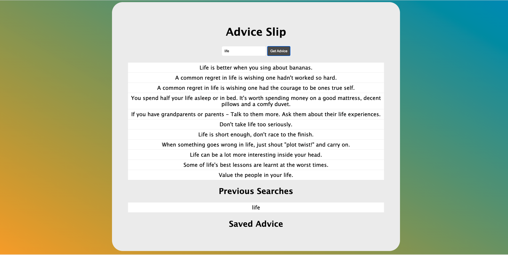

# Advice App



## Prefer a Video Walkthrough?

Check out the video tutorial (COMING SOON)

## Table of Contents

1. [Intro](#introduction)
2. [Getting Started](#getting-started)
3. [Project Setup](#project-setup)
4. [Steps](#steps)
5. [Creating the Layout (HTML)](#creating-the-layout)
6. [JavaScript for Handling User Clicks (JS)](#javascript-for-handling-user-clicks)
7. [Extra Styling (CSS)](#extra-styling)
8. [Conclusion](#conclusion)

## Introduction

## Getting Started

### Project Setup

1. Create a new project folder with the following files:

   - index.html
   - index.css
   - index.js

2. Populate your html file to include DOCTYPE, html, title, and body tags

   ```html
   <!DOCTYPE html>
   <html lang="en">
     <head>
       <title>Advice App</title>
     </head>
     <body></body>
   </html>
   ```

3. Also include several meta tags for compatability and responsive web design

   ```html
   <meta charset="UTF-8" />
   <meta http-equiv="X-UA-Compatible" content="IE=edge" />
   <meta name="viewport" content="width=device-width, initial-scale=1.0" />
   ```

4. Add a link and script tag to your head tag for your css and js files.

   ```html
   <link rel="stylesheet" href="index.css" />
   <script src="index.js" defer></script>
   ```

5. Now, your index.html should resemble:

   ```html
   <!DOCTYPE html>
   <html lang="en">
     <head>
       <meta charset="UTF-8" />
       <meta http-equiv="X-UA-Compatible" content="IE=edge" />
       <meta name="viewport" content="width=device-width, initial-scale=1.0" />
       <link rel="stylesheet" href="index.css" />
       <script src="index.js" defer></script>
       <title>Advice App</title>
     </head>
     <body></body>
   </html>
   ```

[To Top](#advice-app)

## Steps

### Creating the Layout

We'll need to add a few elements to our html file to allow for user interaction and display the data (quotes) from the fetch request.

Inside of your body tags, add the following tags and attributes:

```html
<main id="container">
  <div id="adviceContainer">
    <h1>Advice Slip</h1>
    <input
      type="search"
      placeholder="Enter Keyword"
      name="search"
      id="search"
    />
    <button id="adviceBtn">Get Advice</button>
    <p id="advice"></p>
    <div id="previousSearches">
      <h2>Previous Searches</h2>
    </div>
    <div id="savedAdvice">
      <h2>Saved Advice</h2>
    </div>
  </div>
</main>
```

Now we have a main tag that encloses the main content of the document. The div with class 'panel' holds the page title (h1), code tag that displays the generated css background declaration, and button to register user clicks.

[To Top](#advice-app)
