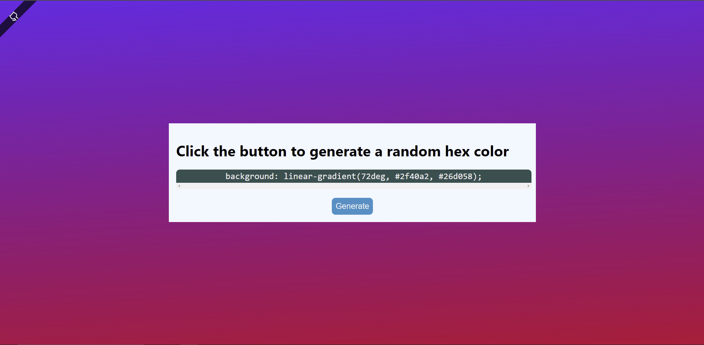

# CSS Color Generator



## Prefer a Video Walkthrough?

Check out the video tutorial (COMING SOON)

## Table of Contents

1. [Intro](#introduction)
2. [Getting Started](#getting-started)
3. [Project Setup](#project-setup)
4. [Steps](#steps)
5. [Creating the Layout (HTML)](#creating-the-layout)
6. [JavaScript for Handling User Clicks (JS)](#javascript-for-handling-user-clicks)
7. [Extra Styling (CSS)](#extra-styling)
8. [Conclusion](#conclusion)

## Introduction

This project is a bare bones frontend project where you will work with HTML, CSS, and JavaScript to dynamically generate css background declarations based on user events. Example:

```css
background: linear-gradient(92deg, #fd34ds, #99llr0);
```

[To Top](#css-color-generator)

## Getting Started

### Project Setup

1. Create a new project folder with the following files:

   - index.html
   - index.css
   - index.js

2. Populate your html file to include DOCTYPE, html, title, and body tags

   ```html
   <!DOCTYPE html>
   <html lang="en">
     <head>
       <title>CSS Color Generator</title>
     </head>
     <body></body>
   </html>
   ```

3. Also include several meta tags for compatability and responsive web design

   ```html
   <meta charset="UTF-8" />
   <meta http-equiv="X-UA-Compatible" content="IE=edge" />
   <meta name="viewport" content="width=device-width, initial-scale=1.0" />
   ```

4. Add a link and script tag to your head tag for your css and js files.

   ```html
   <link rel="stylesheet" href="index.css" />
   <script src="index.js" defer></script>
   ```

5. Now, your index.html should resemble:

   ```html
   <!DOCTYPE html>
   <html lang="en">
     <head>
       <meta charset="UTF-8" />
       <meta http-equiv="X-UA-Compatible" content="IE=edge" />
       <meta name="viewport" content="width=device-width, initial-scale=1.0" />
       <link rel="stylesheet" href="index.css" />
       <script src="index.js" defer></script>
       <title>CSS Color Generator</title>
     </head>
     <body></body>
   </html>
   ```

[To Top](#css-color-generator)

## Steps

### Creating the Layout

We'll need to add a few elements to our html file to allow for user interaction and display the generated background color.

Inside of your body tags, add the following tags and attributes:

```html
<main>
  <div class="container">
    <div class="panel">
      <h1>Click the button to generate a random hex color</h1>
      <pre>
        <code>background: <span class="generated-color">#ffffff;</span></code>
      </pre>
      <button id="generatorBtn" class="btn btn-primary">Generate</button>
    </div>
  </div>
</main>
```

Now we have a main tag that encloses the main content of the document. The div with class 'panel' holds the page title (h1), code tag that displays the generated css background declaration, and button to register user clicks.

[To Top](#css-color-generator)

### JavaScript for Handling User Clicks

Since we added the 'defer' attribute to our script tag, we can be assured that our js won't load until our html elements do.

At the top of the index.js file, create three variables that we will select and assign DOM elements to.

```js
const btn = document.querySelector("#generatorBtn");
const container = document.querySelector(".container");
const generatedColor = document.querySelector(".generated-color");
```

1. The btn variable is assigned the button dom element that the user will click on
2. The container variable is assigned the div dom element that we will change the background of
3. The generatedColor variable is assigned the span dom element where we will change the text content to display the background declaration that we apply to the container

Add one more variable 'gradients' that we will assign an array value to:

```js
const gradients = ["none", "linear", "radial"];
```

We'll use this array when we generate background gradients.

Next, create a function named 'generateHexColor', that takes in 0 parameters, and consists of the following:

```js
let selectGradient = gradients[Math.floor(Math.random() * gradients.length)];
generatedColor.textContent = determineBackground(selectGradient) + ";";
container.setAttribute(
  "style",
  `background: ${determineBackground(selectGradient)};`
);
```

The purpose of this function is to reassign the generatedColor's (span) text content to the newly generated background value (from determineBackground), and set the style attribute on the container (div) to change it's background color.

Don't know what determineBackground does? Let's create that function now:

```js
function determineBackground(gradient) {
  if (gradient == "none") {
    return randomHex();
  } else {
    if (gradient == "linear") {
      let degrees = Math.floor(Math.random() * 360) + 1;
      return `${gradient}-gradient(${degrees}deg, ${randomHex()}, ${randomHex()})`;
    } else {
      return `${gradient}-gradient(${randomHex()}, ${randomHex()})`;
    }
  }
}
```

'determineBackground' takes in a single parameter 'gradient' (from generateHexColor) and uses a selection statement to return a response (string).

If the gradient value is 'none', it returns a single random hex color. Else, if the gradient is linear or radial, it returns the appropriate css gradient function with multiple hex values for the background.

Lastly, we'll need to create the function 'randomHex' to return our hex values:

```js
function randomHex() {
  return "#" + (Math.random() * 0xfffff * 1000000).toString(16).slice(0, 6);
}
```

Simple. 'randomHex' takes in 0 parameters, and returns a string (staring with '#') that uses Math.random() multiplied with hex values (and the .toString(16) method) to generate a random hexadecimal number.

All of this together should resemble:

```js
const btn = document.querySelector("#generatorBtn");
const container = document.querySelector(".container");
const generatedColor = document.querySelector(".generated-color");

const directions = [];
const gradients = ["none", "linear", "radial"];

btn.addEventListener("click", generateHexColor);

function generateHexColor() {
  let selectGradient = gradients[Math.floor(Math.random() * gradients.length)];
  generatedColor.textContent = determineBackground(selectGradient) + ";";
  container.setAttribute(
    "style",
    `background: ${determineBackground(selectGradient)};`
  );
}

function determineBackground(gradient) {
  if (gradient == "none") {
    return randomHex();
  } else {
    if (gradient == "linear") {
      let degrees = Math.floor(Math.random() * 360) + 1;
      return `${gradient}-gradient(${degrees}deg, ${randomHex()}, ${randomHex()})`;
    } else {
      return `${gradient}-gradient(${randomHex()}, ${randomHex()})`;
    }
  }
}

function randomHex() {
  return "#" + (Math.random() * 0xfffff * 1000000).toString(16).slice(0, 6);
}
```

[To Top](#css-color-generator)

### Extra Styling

Alright, so it works. Great! But it may look bland :/. So now let's add some css styling.

For the html and body:

```css
html,
body {
  font-family: "Segoe UI", Tahoma, Geneva, Verdana, sans-serif;
  font-size: 16px;
  min-height: 100vh;
  box-sizing: border-box;
  margin: 0%;
}
```

For the div.container:

```css
.container {
  display: flex;
  align-items: center;
  justify-content: center;
  height: 100vh;
  position: relative;
}
```

For the generated css background declaration:

```css
pre {
  background-color: darkslategrey;
  color: #eee;
  border-radius: 10px;
  display: flex;
  align-items: center;
  justify-content: center;
  font-size: 1.2rem;
  padding: 0.2rem;
  overflow-x: scroll;
  width: 100%;
  text-align: center;
}

code {
  width: 100%;
}
```

For the button:

```css
.btn {
  border: none;
  border-radius: 10px;
  padding: 0.5rem;
  cursor: pointer;
  display: block;
  margin: 0 auto;
  font-size: 1.1rem;
}

.btn:hover {
  opacity: 0.7;
}

.btn-primary {
  background-color: #0094c8;
  color: #eee;
}
```

For the div.panel:

```css
.panel {
  position: relative;
  padding: 1rem;
  background-color: aliceblue;
  width: 80%;
}

.panel::before {
  background: rgba(0, 0, 0, 0.3);
  content: "";

  /* Position */
  top: 0;
  left: 0;
  position: absolute;
  transform: translate(1rem, 1rem);

  /* Size */
  height: 100%;
  width: 100%;

  /* Display under the main content */
  z-index: -1;
}
```

For reponsive sizing on bigger screens:

```css
@media (min-width: 768px) {
  .panel {
    width: 50%;
  }
  html,
  body {
    font-size: 20px;
  }
}
```

That's all I'll add for now, but don't let me hold you back. Style it up!

[To Top](#css-color-generator)

## Conclusion

This project is a fun project that practices your fundamentals with html, css, and JavaScript. You created html elements, added css rulesets, and worked with JavaScript **DOM manipulation**, **functions**, **variables**, **arrays**, **Math object**, and **template strings** (among others). It's great that you made it this far, but I always encourage you to add new features that are now listed in this walkthrough. Challenge yourself, have fun, and remember your ABCs.

**ALWAYS BE CODING.**

[To Top](#css-color-generator)
